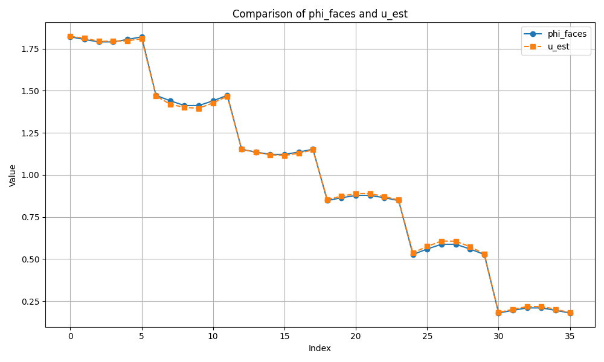
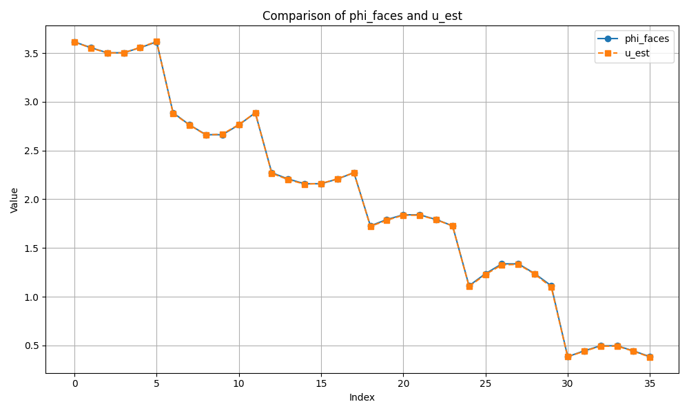

# Data-Driven-Exterior-Calculus

This is an implementation of PDE Constrained Optimization, using the Data Driven Exterior Calculus framework presented in this [paper](https://www.sciencedirect.com/science/article/pii/S0021999122000316?ref=pdf_download&fr=RR-2&rr=91c8010afddfff9b) (Trask et al., 2022). 

## Setup

Made use of a conda environment to manage the packages and libraries required. Setup a conda environment, activate it, and install requirements as follows:
```
conda create -n ddec_env python=3.8
conda activate ddec_env
pip3 install -r requirements.txt
```

## Training and Testing for Darcy Flow

```
python run.py --N={Grid Size} --alpha={boundary condition} --iter={Iterations} --tol={Iterative Solver Tolerance} --epsilon={Non-Linear weight} --epochs={Training Epochs} --problem_type={Darcy D1/D2} --lr={Learning Rate}
```

## Darcy problem D1 results

The following are the results for the D1 problem of the paper over different domain sizes. Clearly the linear model trains very well, with the loss falling rapidly.


## Darcy problem D2 results

The following are the results for the D2 problem of the paper. The model was trained with a batch size of 3 for different boundary conditions ($\alpha \in \{1,2,4\}$) for a grid size of 7x7.






A modification was made to the non-linear strategy as compared to the original paper, which should scale better for larger problems. In the paper a non-linear perturbation is added into the differential equation representation itself, represented by a neural network. The equation is as follows:
$$
DIV.GRAD*.u_0 \; + \; \epsilon.DIV.\mathcal{NN}(GRAD*.u_0; \xi) = f_0
$$

This means that when training our model, since we are computing $u_0$ iteratively, we also need to compute the jacobian (and its inverse). This clearly doesn't scale well for larger problems. Instead we have introduced a non-linear perturbation to the estimated solution itself:

$$
u = \hat{u} + \epsilon.\mathcal{NN}(f; \xi)
$$
